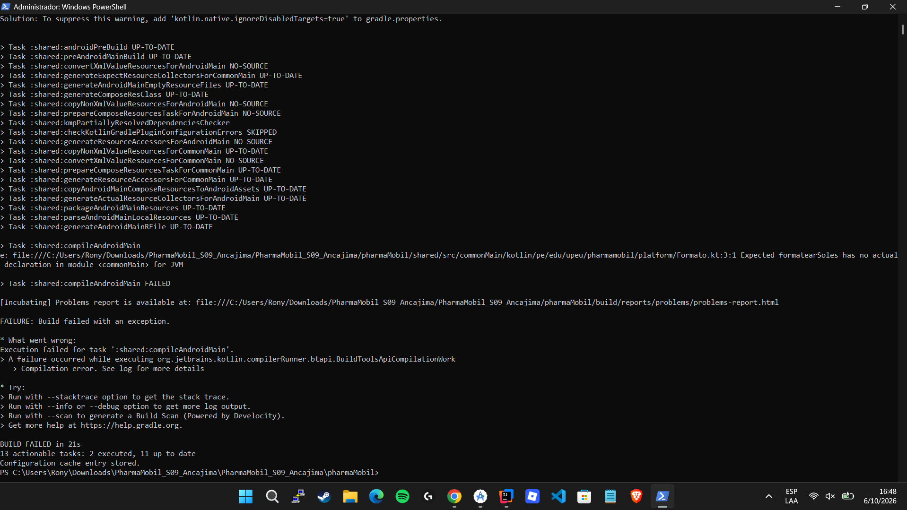
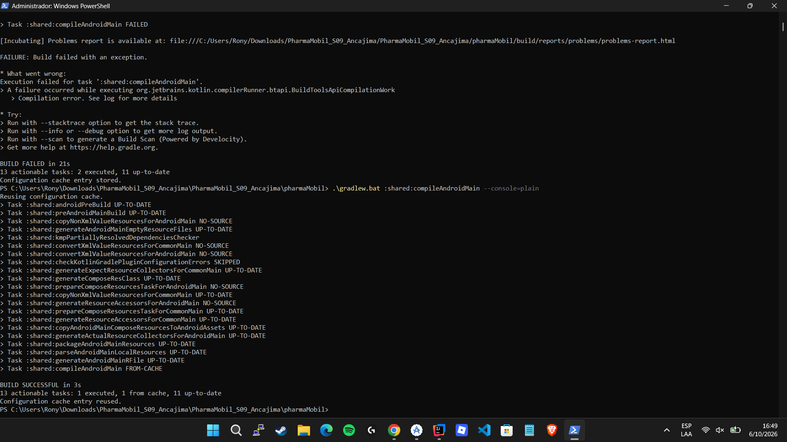
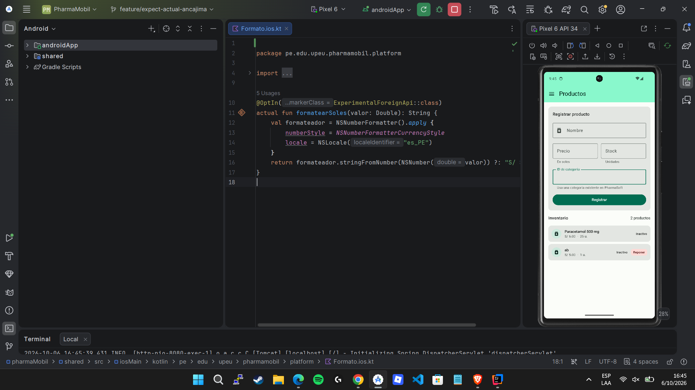
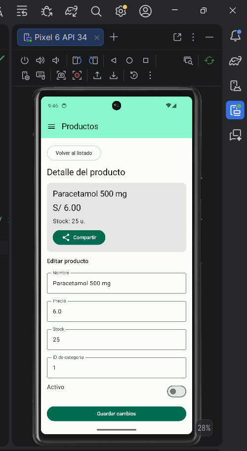
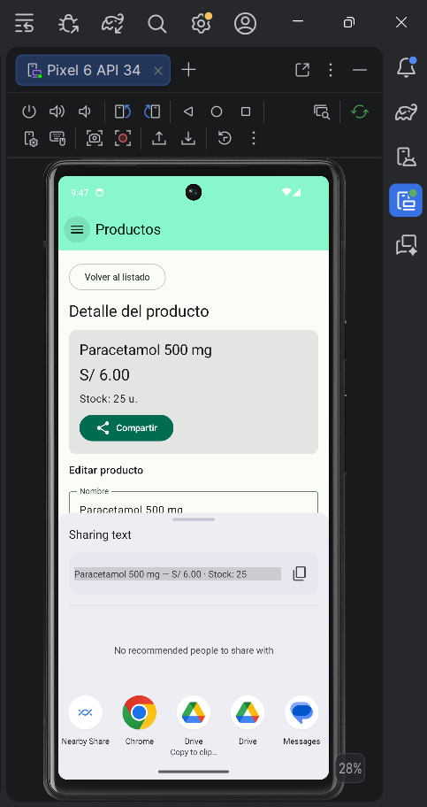
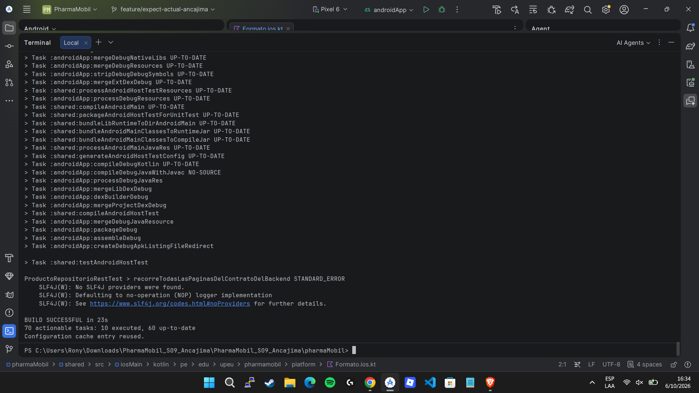
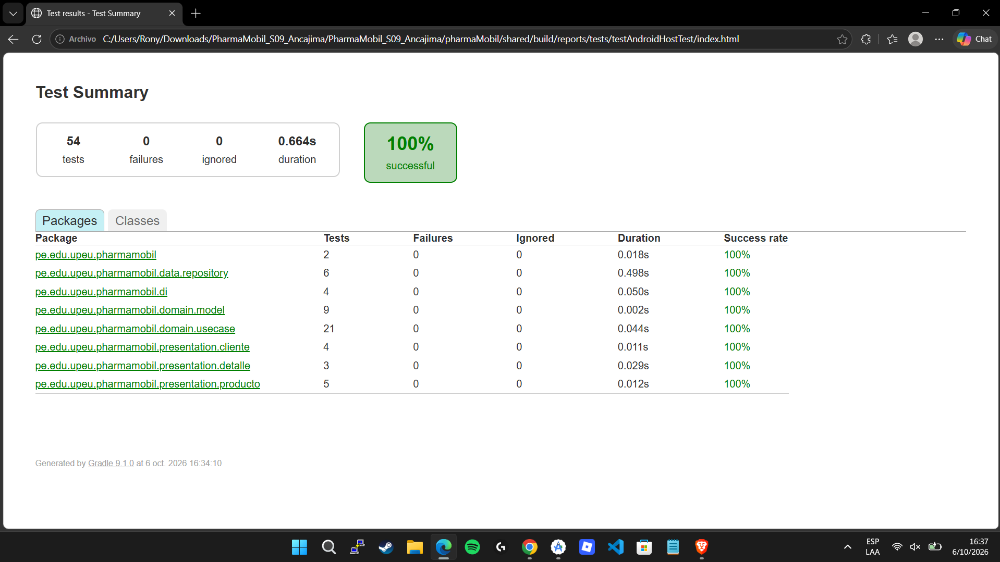
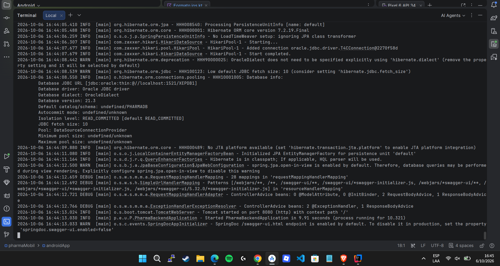

# Evidencias reales — Sesión 09

**Estudiante:** Rony Alonso Ancajima Tripul  
**Fecha:** 6 de octubre de 2026  
**Entorno observado:** Windows, Android Studio, Pixel 6 API 34, Gradle 9.1.0, Java 21.0.9 para PharmaSoft, Oracle 21.3 con XEPDB1.

Las imágenes son capturas originales aportadas por el estudiante durante la ejecución. Se conservan sin alterar sus resultados. Los números 3 y 5 se reservan para las evidencias iOS de la guía.

| Orden de la guía | Archivo | Resultado acreditado | Estado |
|---|---|---|---|
| 1 | `01_error_falta_actual.png` | Kotlin reclama el `actual` de `formatearSoles` | Verificado |
| 2 | `02_android_listado_soles.png` | Inventario y precio S/ 6.00 en Android | Verificado |
| 3 | `03_ios_listado_soles.png` | Listado con moneda en iOS | Pendiente; archivo no incluido |
| 4 | `04_android_compartir.png` | Selector Android con nombre, precio y stock | Verificado |
| 5 | `05_ios_compartir.png` | Hoja nativa de iOS | Pendiente; archivo no incluido |

## 1. Punto de control expect/actual

Se cambió temporalmente la extensión de `Formato.android.kt` y se ejecutó `:shared:compileAndroidMain`. El error relevante fue `Expected formatearSoles has no actual declaration in module <commonMain> for JVM`. Es el fallo intencional del punto de control.



El archivo se restauró mediante el bloque `finally`. La verificación posterior terminó con `BUILD SUCCESSFUL in 3s`; `:shared:compileAndroidMain` aparece `FROM-CACHE`, por lo que no se presenta como una recompilación completa desde cero.



## 2. Inventario Android y formato monetario

La app obtuvo dos productos de PharmaSoft. Paracetamol 500 mg muestra **S/ 6.00**, con **25 unidades**. El segundo registro muestra **S/ 5.00**. Ambos registros figuran como inactivos. El símbolo observado es `S/`, seguido de espacio, y el precio presenta dos decimales con punto.



## 3. Detalle y compartir en Android

El detalle conserva Paracetamol 500 mg, S/ 6.00 y stock 25. Al pulsar Compartir se abrió el selector del sistema, con el texto `Paracetamol 500 mg — S/ 6.00 · Stock: 25`. No se necesitó enviar un mensaje a otra persona para comprobar la apertura del selector.





## 4. Compilación del APK y pruebas automatizadas

Comando ejecutado por el estudiante:

```powershell
.\gradlew.bat :androidApp:assembleDebug :shared:testAndroidHostTest --console=plain
```

El comando terminó con `BUILD SUCCESSFUL in 23s`. El resumen HTML de `shared/build/reports/tests/testAndroidHostTest/index.html` muestra:

| Medida | Resultado |
|---|---|
| Pruebas | 54 |
| Fallos | 0 |
| Omitidas | 0 |
| Éxito | 100 % |
| Duración de pruebas | 0,664 s |

Los 70 elementos `actionable tasks` del log son tareas de Gradle, no la cantidad de pruebas. El informe muestra 2 pruebas del paquete principal, 6 de repositorios, 4 de inyección, 9 de modelos, 21 de casos de uso, 4 de clientes, 3 de detalle y 5 de productos. La suma es 54. Las pruebas de host utilizan dobles y MockEngine; la captura del inventario aporta evidencia adicional de la conexión real.





## 5. Backend y base de datos utilizados

PharmaSoft inició con Tomcat en el puerto 8080 y conectó a Oracle 21.3 en XEPDB1. El primer intento se detuvo por una diferencia de checksum de Flyway V1. Para las pruebas se desactivó Flyway solo en el comando de arranque, conservando `ddl-auto=validate`. El inventario se cargó después de pulsar Reintentar.

```powershell
.\mvnw.cmd spring-boot:run "-Dspring-boot.run.profiles=sesion09" "-Dspring-boot.run.arguments=--spring.flyway.enabled=false --spring.jpa.hibernate.ddl-auto=validate"
```



## 6. Comparación y reflexión

`expect/actual` permite que la pantalla utilice el mismo contrato de moneda mientras cada plataforma utiliza su formateador. En Android se observó `S/ 6.00`. En el código iOS se utiliza NSNumberFormatter con es_PE, pero no se ha observado su resultado en un dispositivo o simulador. La comparación empírica de símbolos y espacios entre plataformas queda pendiente.

El contrato Compartidor permite inyectar la capacidad nativa en el ViewModel y sustituirla por un doble en las pruebas. En Android se comprobó la apertura del selector. La implementación de UIActivityViewController en iOS requiere verificar su presentación en el simulador, incluyendo ventana activa y configuración del popover. Las capturas del archivo `Formato.ios.kt` abierto en Android Studio muestran código, no ejecución iOS.

## 7. Repositorio y pendientes

- [Repositorio publicado](https://github.com/Alonso-Tripul/PharmaMobil-S09).
- [Rama feature/expect-actual-ancajima](https://github.com/Alonso-Tripul/PharmaMobil-S09/tree/feature/expect-actual-ancajima).
- [Historial de commits](https://github.com/Alonso-Tripul/PharmaMobil-S09/commits/feature/expect-actual-ancajima).
- Publicar estas capturas y documentación con un commit propio.
- Comprobar en el historial los tres commits propios exigidos; se observó en consola el commit `c9abcbb` de la corrección REST y su envío.
- Compilar y ejecutar iOS en una Mac con Xcode; capturar listado y hoja de compartir del mismo producto, precio 6.00 y stock 25.
- Registrar versión de iOS y diferencias de formato realmente observadas.
- Revisar el historial de Flyway antes de usar nuevamente las migraciones sobre este esquema.

La evidencia disponible acredita los puntos 1, 2 y 4 de la guía, además del APK y las 54 pruebas de host. Los puntos 3 y 5 siguen pendientes. No se declara una entrega con todas las evidencias completas.
